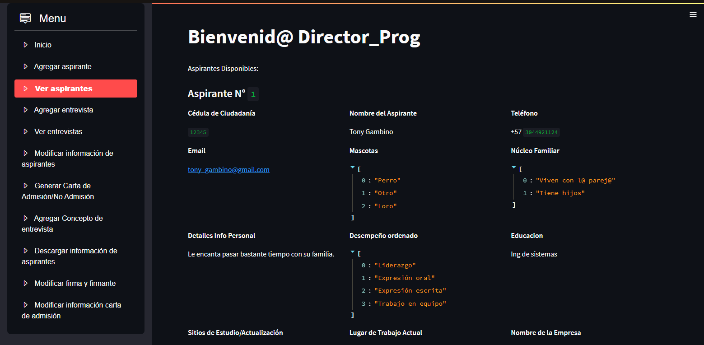
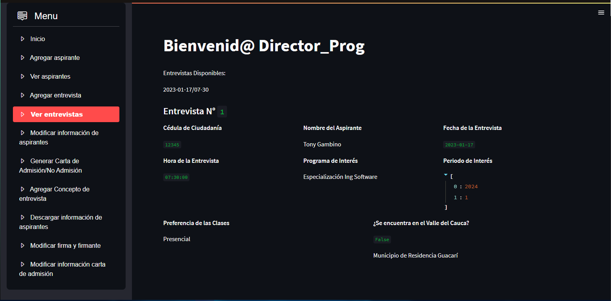

Gestor de Entrevistas Aspirantes Posgrado
=======

Visión General
--------

La función de este programa es servir como sistema de información que facilite 
la evaluación de los aspirantes a los posgrados. El programa gira en torno a 
tres roles principales: la directora del programa, la secretaria de posgrados y 
el director de posgrados.

UML del Programa
--------

Características
--------

Entre las características proporcionadas por el Gestor de Entrevistas Aspirantes
Posgrado:

- Inicio de Sesión:
Para poder diferenciar los roles que se encuentran actualmente en el sistema, se ha creado un sistema de inicio de sesión. En el mismo, el rol correspondiente tendrá que acceder con su usuario y contraseña. Los guardados actualmente se encuentran en `authentication/generate_keys.py`

- Registrar información de un aspirante:
Para efectos de sencillez en el programa, se separaron los datos como tal del aspirante de la entrevista. Por tanto, en este apartado se guardaran los datos de la persona.

- Mostrar los aspirantes registrados:
Aquí se podrán ver todos los aspirantes registrados en el sistema.

- Registrar información de una entrevista dado un aspirante:
Esta sería la segunda parte de los datos a recolectar. Ahora aquí se solicitan los datos de la entrevista como tal.

- Mostrar las entrevistas registradas:
(Aquí se ve una fecha que se nos olvidó borrar porque no hace nada)
En este apartado, se verían los datos de la entrevista y el nombre e id del aspirante. Esto para no hacer tan largo el programa y, si desea el usuario mirar los datos del aspirante, ya sabe cuál id buscar en la lista de aspirantes.

- **Directora programa** Descargar información aspirantes dados los rangos de fecha de las entrevistas:
Teniendo en cuenta los rangos de fechas que otorgará la directora de programa, el programa generará una hoja de excel donde guardará los datos **solamente** de los aspirantes, mas no de las entrevistas. Todos los Excel generados se guardarán en la carpeta `outputs`

Ejemplos de hojas de excel en la carpeta `outputs`

- **Directora programa/Secretaria posgrados** Modificar firma y firmante:
El sistema por defecto viene con una firma cualquiera, un firmante cualquiera y un rol cualquiera. Mostrará todos los datos actuales para comodidad del usuario. Simplemente hay que digitar los nuevos datos y estos se actualizarán sin ningún problema.

- **Directora programa/Secretaria posgrados** Modificar información carta de admisión:
Hay ciertos datos en la carta de admisión que cambian a medida que pasa el tiempo. Es por esto que se le da la facilidad al usuario de modificar estos datos cuando sea necesario y que la generación de carta salga de manera adecuada.

Build

- Generar carta de admisión/no admisión:
Este apartado generará un archivo PDF que sería una carta dependiendo de los resultados de la entrevista. **OJO:** Los resultados de la entrevista dependerán del apartado `concepto de entrevista`. Se distinguirán las cartas de cada aspirante ya que, el nombre de las mismas, tendrá en cuenta el id del aspirante.

Ejemplo de carta en la carpeta `outputs`

- Consultar/editar información de aspirantes:
Este apartado es tanto sencillo como interesante. Para no complicar al usuario a la hora de editar la información, se hizo algo muy especial. Se implementaron desplegables para ingresar la información que desee modificar el usuario, ya sea cambiar la información del aspirante o de la entrevista.

- **Varía en cada rol** Agregar concepto de entrevista:
    - **Directora de Programa**
    La directora puede decidir si admitir o no a un aspirante. También, puede decidir si la admisión se hará para el periodo en el que el aspirante solicitó la admisión o para el periodo siguiente. Esto sucede por ejemplo porque la directora considera que al aspirante le falta experiencia profesional. Ej: Un aspirante que se inscriba para ser admitido en el 2023-1 podría ser admitido a criterio de la directora para el 2023-2.

    - **Director de Posgrados**
    El director solamente podrá admitir o no al aspirante seleccionado. El periodo se quedará por defecto.

    - **Secretaria de Posgrados**
    La secretaria solamente podrá rechazar aspirantes, osea, no admitirlos.

- Estadísticas:
Este apartado muestra una serie de estadísticas de los datos registrados en el sistema. Esto se hace para que el usuario pueda hacer un seguimiento de algunas de las tendencias en algunos de los datos actuales.

**¡¡¡IMPORTANTE!!!** Aspectos a tener en cuenta
-------
1. **Cierre de sesión:** Para poder cerrar sesión, es necesario refrescar o cerrar y volver a abrir el programa. Esto sucede porque el inicio de sesión hace que una variable se genere con un tipo de objeto. El tipo de objeto no se puede cambiar a lo largo del programa. Este problema es también un causante del siguiente.
2. **Pérdida de datos:** Debido a los conocimientos actuales que poseemos de Python, el programa no maneja guardado de archivos. Es decir, cada vez que se vuelva a cargar o se cierre y se vuelva a abrir el programa, este perderá los datos que tenía guardados en la anterior sesión.
3. **Datos de referencia iguales:** El programa usa como referencia de cada dato el id del aspirante y la fecha y hora de la entrevista. En caso de que se agregue un nuevo aspirante o entrevista con una referencia que ya está registrada, no dará error el programa, pero al usar diccionarios, reescribirá los datos que se encuentran en esa referencia con los datos que haya registrado el usuario actualmente.
4. **Deja crear entrevistas el mismo día en el que se abre el programa:** ¿Que quiere decir esto? Si el usuario abre el programa el día 2022/11/28 a las 9:48:00, el programa no pone conflicto con que se cree una entrevista para esa misma fecha o fechas pasadas (lo cual es imposible a nivel lógico).

Instalación
-------

- Abre la carpeta del archivo
- Dirigete a la consola de comandos en esa misma dirección de la carpeta
- Digite `virtualenv venv`
- Digite `venv\Scripts\activate`
- Digite `pip install -r requirements.txt`
- Digite `streamlit run main.py`
- Disfrute :)